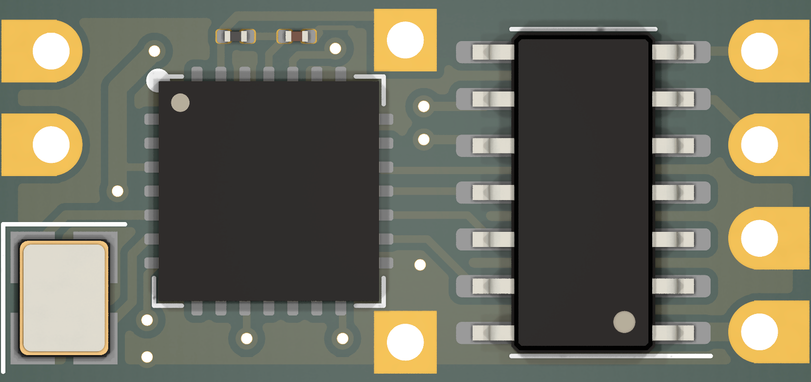
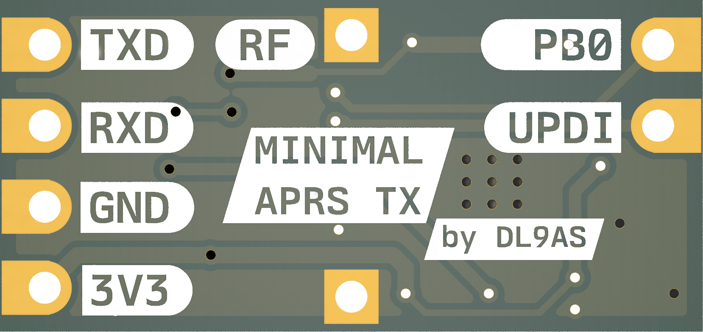
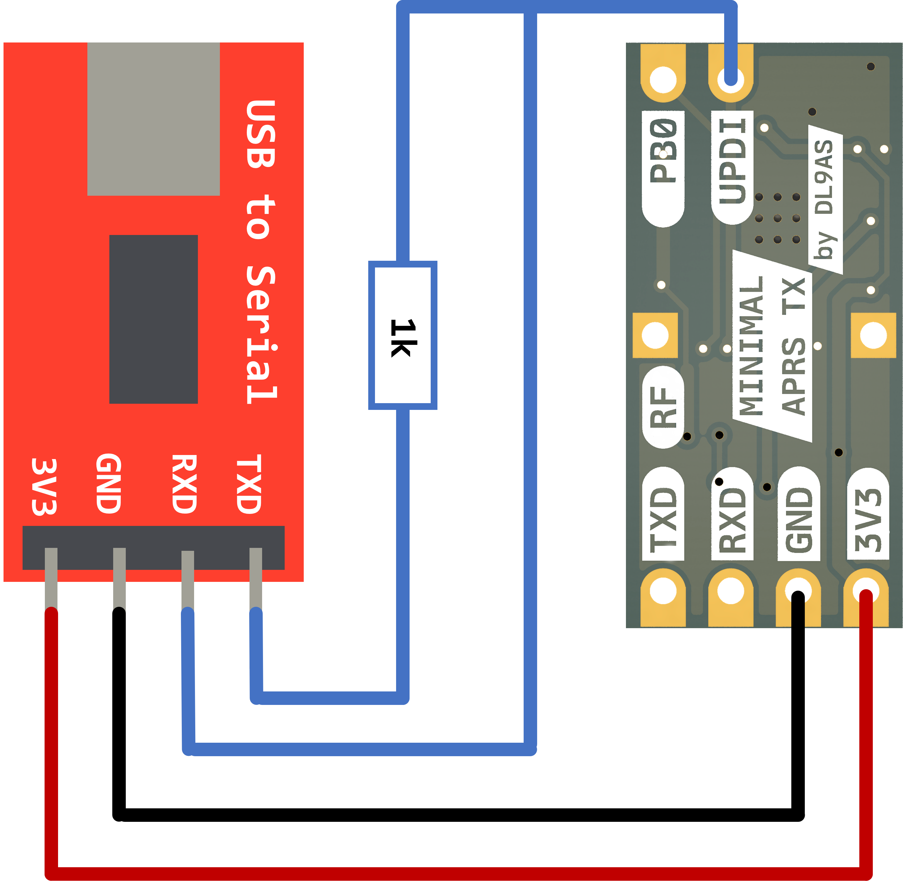

# Minimal APRS TX by DL9AS

**Note: This project is still in active development. There is no guarantee for full functionality at this time!**

The goal of this project is to provide one of the simplest APRS transmitters. It is especially designed for people who are starting high altitude ballooning. If you are interested in more advanced APRS radiosondes with camera, please have a look at this repository: https://github.com/DL9AS/jufo-project-radiosonde

The PCB requires only five components. The transmitter can be controlled with simple serial commands.

|  |  |
|:-------------------------------------------- |:------------------------------------------- |

## Table of contents

- [Minimal APRS TX by DL9AS](#minimal-aprs-tx-by-dl9as)
  - [Table of contents](#table-of-contents)
  - [Usage](#usage)
    - [`$STAT` *(Get status)*](#stat-get-status)
    - [`$CfgRadio` *(Configure APRS radio)*](#cfgradio-configure-aprs-radio)
    - [`$TxPosPkt` *(Transmit APRS position packet)*](#txpospkt-transmit-aprs-position-packet)
    - [`$TxStatPkt` *(Transmit APRS status packet)*](#txstatpkt-transmit-aprs-status-packet)
  - [PCB Assembly](#pcb-assembly)
  - [Programming](#programming)


## Usage


Only a few commands are required to use the Minimal APRS TX module. First the radio is configured with the command `$CfgRadio` and then APRS packets can be sent with the commands `$TXPosPkt` or `$TXStatPkt`.

For communication `9600 Baud` serial with 8 data bits, no parity, one stop bit is used. So it should communicate out of the box with any Arduino.

### `$STAT` *(Get status)*

```
Format:
$STAT;

Return:
[ACK] Minimal APRS TX - V1.0
```

### `$CfgRadio` *(Configure APRS radio)*

```
Format:
$CfgRadio <APRS_Freq>,<APRS_Freq_Err>,<TX_PWR>,<Afsk_Tone>,<Freq_Dev>,<Src_Call>,<Src_ID>,<Digi_Call>,<Digi_SSID>;

Example:
$CfgRadio 144800000,0,17,205,2700,DL9AS,11,WIDE1,1;
```

- `<APRS_Freq>` - APRS frequency in Hz (e.g. `144800000`)
- `<APRS_Freq_Err>` - APRS frequency error/offset in Hz (e.g. `0`)
- `<TX_PWR>` - Transmission power from 2dbm to 20dbm (e.g. `17`)
- `<Afsk_Tone>` - AFSK tone adjustment (e.g. `205`)
- `<Freq_Dev>` - FSK deviation in Hz (e.g. `2700`)
- `<Src_Call>` - APRS source callsign (e.g. `DL9AS`)
- `<Src_ID>` - APRS source SSID (e.g. `11`)
- `<Digi_Call>` - APRS digipeater path callsign (e.g. `WIDE1`)
- `<Digi_SSID>` - APRS digipeater path SSID (e.g. `1`)

### `$TxPosPkt` *(Transmit APRS position packet)*

```
Format:
$TxPosPkt <Lat>,<Long>,<Alt>,<Symbol>,<Symbol_Overlay>,<Comment>;

Example:
$TxPosPkt 525121,133273,42,O,/,"73 from DL9AS";

Resulting APRS packet:
DL9AS-11>AMON,WIDE1-1:!5230.72N/01319.63EO/A=000137/N0T26V31 73 from DL9AS
```

- `<Lat>` - GPS Latitude in deg * 10000 (e.g. `525121`)
- `<Long>` - GPS Longitude in deg * 10000 (e.g. `133273`)
- `<Alt>` - GPS Altitude in meters (e.g. `42`)
- `<Symbol>` - APRS symbol (e.g. `O` for balloon)
- `<Symbol_Overlay>` - APRS symbol overlay (e.g. `/` for balloon)
- `<Comment>` - APRS comment with 50 character max (e.g. `"73 from DL9AS"`)

Note: `(N<Pkt_count>T<Temperature>V<VCC*10>)` is automatically added to the final packet.

### `$TxStatPkt` *(Transmit APRS status packet)*

```
Format:
$TxStatPkt <Comment>;

Example:
$TxStatPkt "73 from DL9AS";

Resulting APRS packet:
DL9AS-1>AMON,WIDE1-1:>N0T0V31 73 from DL9AS
```

- `<Comment>` - APRS comment with 80 character max (e.g. `"73 from DL9AS"`)

Note: `(N<Pkt_count>T<Temperature>V<VCC*10>)` is automatically added to the final packet.

## PCB Assembly

<table>
  <tr>
    <td>In a first step, with the help of the <a href="Hardware/Gerber-Files/">gerber files</a>
, the custom PCBs are ordered from a PCB manufacturer. I would also recommend to order a stencil, that makes the soldering easier.</td>
    <td></td>
  </tr>
</table>

The needed components can now be ordered:

| Designator | Part                            | Quantity | Price (09.2023) |
| ---------- | ------------------------------- | -------- | --------------- |
| U1         | ATTiny1604                      | 1        | 0.81$           |
| U2         | SX1278IMLTRT                    | 1        | 2.65$           |
| X1         | 32MHz Crystal (SMD3225 package) | 1        | 0.15$           |
| C1         | 100nF (0402 package)            | 1        | 0.01$           |
| L1         | 200nH (0402 package)            | 1        | 0.01$           |

With the PCBs and the components, the transmitter can now be assembled. I would recommend reflow soldering with stencil. It is important that the correct orientation of the ICs is ensured. This [interactive BOM](https://htmlpreview.github.io/?https://github.com/DL9AS/Minimal-APRS-TX/blob/main/Hardware/InteractiveBOM.html) can help with placing the components.

## Programming

Before the Minimal APRS TX module can be used, the ATTiny1604 microcontroller has to be programmed. Here the firmware can be built from the source code or the ready binaries can be used. To keep these instructions as simple as possible, I will describe the second option.

1. First you want to install the `pymcuprog` utility. This requires Python and can be done using `pip install pymcuprog`.  See https://pypi.org/project/pymcuprog/ for more information.
2. Download the correct firmware binary from [here](Software/Binaries/).
3. Connect the USB to serial adapter and install serial drivers if necessary.
4. Run the following command to upload the firmware: 

```
pymcuprog write -d attiny1604 -t uart --erase --verify -u <PORT> -f <FIRMWARE>
```

- `<PORT>` - Serial Port (e.g. `COM5` or `ttyACM0`)
- `<FIRMWARE>` - Firmware file (e.g. `Minimal-APRS-TX_V1.0.hex`)

